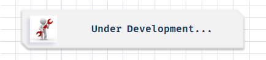

  

<h1 align="center">
:small_red_triangle_down: API Request of Crypto currencies 
</h1>

  

<h2 align="center">
Bootcamp everis Fullstack Developer by Digital Innovation One
</h2>

  

  

This repository was created as part of bootcamp "everis FullStack Developer" by Digital Innovation One and it's purpose is building a page to request crypto currencies data from CoinMarketCap API.

  <a href="#cloud-deploy">Deploy</a>&nbsp;&nbsp;&nbsp;|&nbsp;&nbsp;&nbsp;
  <a href="#rocket-technologies">Technologies</a>&nbsp;&nbsp;&nbsp;|&nbsp;&nbsp;&nbsp;
  <a href="#computer-installation">Installation</a>&nbsp;&nbsp;&nbsp;|&nbsp;&nbsp;&nbsp;
  <a href="#books-learning">Learning</a>&nbsp;&nbsp;&nbsp;|&nbsp;&nbsp;&nbsp;
  <a href="#small_orange_diamond-sharing">Sharing</a>&nbsp;&nbsp;&nbsp;|&nbsp;&nbsp;&nbsp;
  <a href="#small_orange_diamond-customizing">Customizing</a>&nbsp;&nbsp;&nbsp;|&nbsp;&nbsp;&nbsp;
  <a href="#small_orange_diamond-license">License</a>

  

## :cloud: Deploy

  Was used GitHub.io to publish this page. IMPORTANT: As a browser extension will be needed to run this app you will only be able to see it in a DESKTOP device. 
  
  Follow the instructions in step 2 of section Installation in this README to install the extension needed BEFORE to click on the link below to see it:

  - [https://clovisdanielcosta.github.io/api-criptomoedas/](https://clovisdanielcosta.github.io/api-criptomoedas/)

## :rocket: Technologies
  To build this project the follow technologies were used:

  - [Html5](https://developer.mozilla.org/pt-BR/docs/Web/HTML/HTML5)
  - [Css3](https://www.w3schools.com/css/)
  - [JavaScript](https://developer.mozilla.org/pt-BR/docs/Web/JavaScript)
  - [CoinMarketCao - API](https://coinmarketcap.com/api/)
  - [Moesif Origin & CORS (Browser extension)](https://chrome.google.com/webstore/detail/moesif-origin-cors-change/digfbfaphojjndkpccljibejjbppifbc?hl=pt-BR/)

## :computer: Installation

  1. Clone this repository in the folder that you want and run index.html on your browser:

  `$ git clone https://github.com/clovisdanielcosta/netflix-interface.git`

  2. On your browser install extension "Moesif Origin & CORS Changer" and turn on to be able to do requests from CoinMarketCap API.
  3. Run file "index.html".
  4. If my monthly requests limits was exceeded you will not be able to see the quotations. Then open an account on CoinMarketCap and insert the key on variable "key" on file "./js/main.js".

## :books: Learning
  - Better understanding about FETCH Requests.
  - Improving CSS skills.
  - Stumble with Moesif Origin & CORS for the first time.
  - Use of CoinMarketCap API for the first time.

## :small_orange_diamond: Sharing

  To get crypto logo images for your app you can reach the site below:

  - [https://cryptologos.cc/](https://cryptologos.cc/)

## :small_orange_diamond: Customizing

  - Applied my own pattern of folders structure and filenames. 
  - Personal choose of fonts and colors.
  - Applied color red for negative values on the Percentage changes.   
  - New requests of Ranking, Price, Volume and Percentage change of crypto currencies. 
  - Import logo images of each crypto coin.
  - And the most IMPORTANT: creation of new giant coin to put fun on this project a little bit      more. You will see it on this first position of list.

## :small_orange_diamond: License

This project is under MIT license. Open file [LICENSE](LICENSE.md) to details. 
The images in this project were made by repo's owner or taken from another repo in the web with the right authorization of use.

## :small_orange_diamond: Thanks

I wanna to say thank you to <b>Digital Innovation One</b> and <b>everis</b> for make this bootcamp possible. Special thanks to Bárbara Casac for teaching in this course. I really love blockchain and crypto currencies. Thank you so much. You all are doing a great job. 

Well done! :clap: :clap: